#	Hands-on Workshop on Learning how to Create Amazon Alexa Skills and Amazon Lex bot

##	Table of Contents
1.	Create the Lex Box Manually
2.	Use Lex Import Function to Create a Lex Bot without Manually Creating Intents
3.	Create Lex Lambda Function
4.	Link Lex bot with the Lex Lambda function
5.	Chat with Lex Bot
6.	Publish the Lex Bot
7.	Bring Lex Bot to Web
8.	Export the Bot to Alexa Skills Kit / Lex Format
9.	Import Lex Intents to Alexa Voice Interface 
10.	Create a Lambda function for Alexa
11.	Add Account Linking For Alexa

##	Overview

(1)	Amazon Lex
Amazon Lex is a service for building conversational interfaces into any application using voice and text. Amazon Lex provides the advanced deep learning functionalities of automatic speech recognition (ASR) for converting speech to text, and natural language understanding (NLU) to recognize the intent of the text, to enable you to build applications with highly engaging user experiences and lifelike conversational interactions. With Amazon Lex, the same deep learning technologies that power Amazon Alexa are now available to any developer, enabling you to quickly and easily build sophisticated, natural language, conversational bots (“chatbots”). This lab is designed to demonstrate how to create a new bot including defining intents and slots. This lab will walk you through the following:

*	Creating a Lex bot
*	Adding intents
*	Adding slot types
*	Using Lambda as the back-end logic for Lex

(2)	Amazon Alexa
Alexa is Amazon’s cloud-based voice service available on tens of millions of devices from Amazon and third-party device manufacturers. With Alexa, you can build natural voice experiences that offer customers a more intuitive way to interact with the technology they use every day. Our collection of tools, APIs, reference solutions, and documentation make it easy for anyone to build with Alexa. This lab include:

*	Creating Alexa Voice Interface
*	Using Lambda as the back-end logic
*	Testing of Alexa skill
*	Alexa linking account 

##	What Bot are You Building? 

###	Amazon Lex
Scan the following QR code and open it on your mobile.

Follow the conversation,

1.	Start by typing “What is my checking account balance?” (or press the microphone button and ask your question using your computer mic).
2.	You should get an answer. 
3.	Then type “What is my home loan balance?” (or ask using your mic)
4.	Type ‘more loan info’.
5.	Type ‘car’.

###	Amazon Alexa
Talk to any Echo device on the table. Say, “open personal banker”.

##	Pre-requisites
1.	You need to bring a laptop. 
The laptop you bring must allow you to access AWS console.

2.	Please open an AWS account. 
Go to https://aws.amazon.com and follow this quick walkthrough 
https://aws.amazon.com/premiumsupport/knowledge-center/create-and-activate-aws-account/  You need a valid credit card to set up your account. However, it will not be charged and we will provide AWS credit code in the workshop for your AWS service consumption.

3.	Please create an Amazon Developer account. 
Go to the https://developer.amazon.com/ create an account for free.

4. 	Relative codes could be found [here](https://github.com/lab798/aws-alexa-workshop-ask/tree/master/workshop)

##	Lab Steps

Note: [click here to download the code files](https://github.com/lab798/aws-alexa-workshop-ask/tree/master/workshop).

### 1.Create the Lex Bot Manually

You can choose to create Lex bot manually, or go to Section 4 Use Lex Import Function to Create a Lex Bot without Manually Creating Intents.

1.	Log in to AWS Lex Console https://console.aws.amazon.com/lex 
2.	If you have never created a bot, click “Get Started”
3.	Choose ‘Custom bot’
4.	Our bot name will be “PersonalBanker”
5.	Choose your preferred output voice
6.	Session timeout should be 5 minute 
7.	Choose “No” to the Children’s Online Privacy Protection Act (COPPA) question

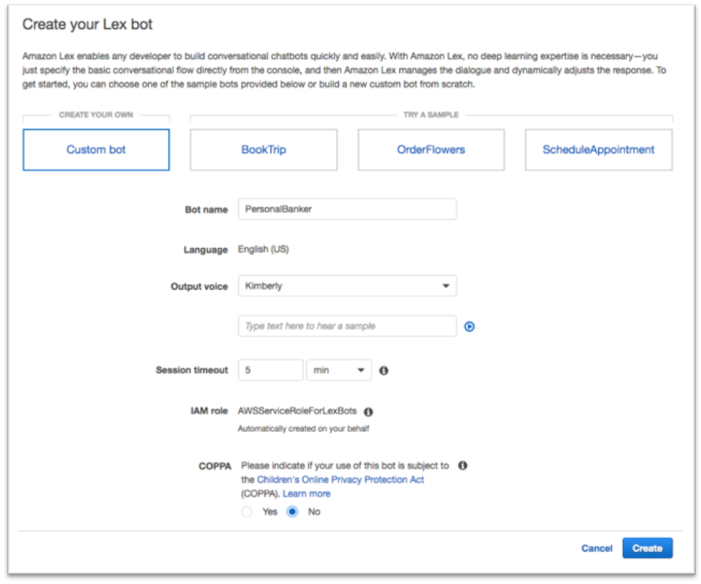

8.	Click Create
9.	We will start by creating an intent, which represents an action that the user wants to perform. For example, we’re going to create three intents in this lab for different actions a user can perform: Get Account Details; Get Loan Details; Get Loan Products.
Click the “Create Intent” button.
10.	In the window that pops-up click the “Create new intent” link.
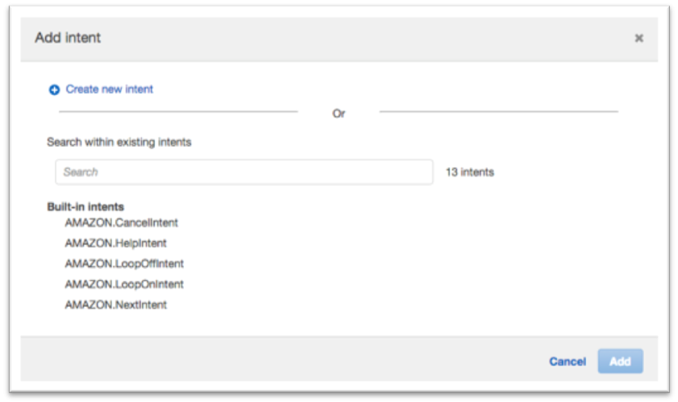

11.	Our first intent enables the user to get account details, so name this intent “GetAccountDetail” then click “Add”.
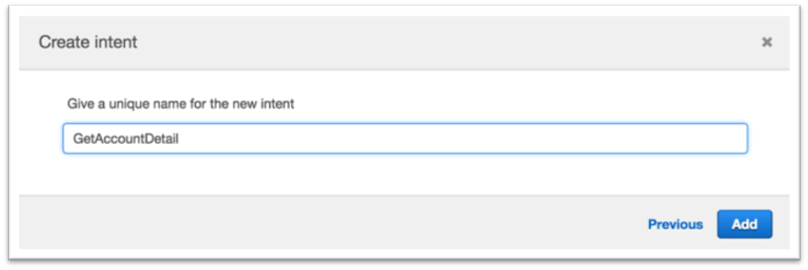

12.	We now want to provide samples of what our user would type or say to perform this action (i.e. to activate this intent). Under “Sample utterances”, type the below phrases and hit [enter] or click the blue “+” sign after each phrase. Make sure you do not add a question mark at the end of the phrase as this will cause build issues later on.
•	What is my {AccountType} balance
•	{AccountType} account balance
NOTE: {AccountType} represents a ‘slot’ which is information that we need to process the users request. Type it exactly as shown above with the braces, and in the next step we will define the ‘AccountType’ slot and list the acceptable values (checking, savings). Once the lab is complete, the user will interact with our bot by saying something like “What is my checking balance”.
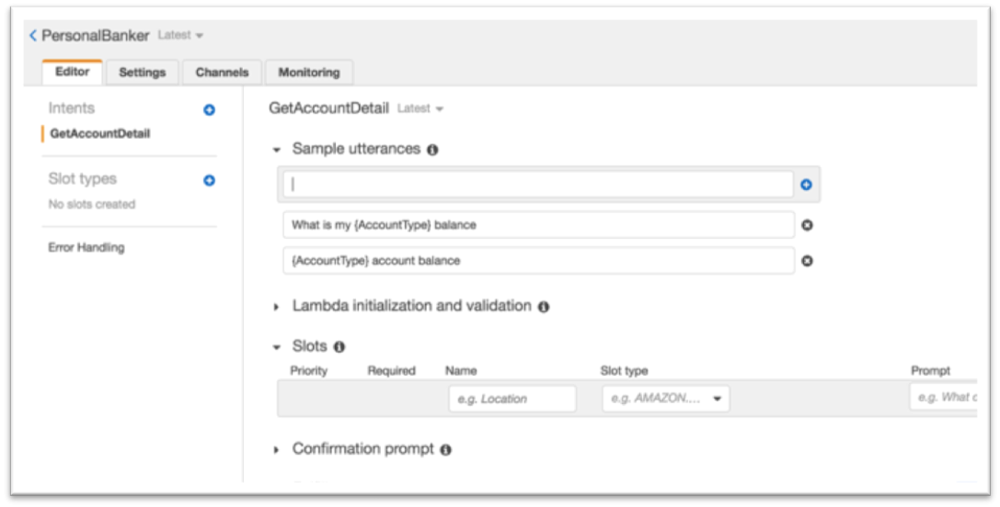

13.	Next we define a slot which is information we need to process the users request. This information can be included in the utterance (query) that the user types or says, and if not included, Lex will prompt the user for the information. While Lex includes many built-in slot types (such as number, color, city, food, etc), in this case we want to define a custom slot to get the account type that the user is referring to. 
Click on the blue “+” sign next to “Slot types” on the left hand side of the screen
14.	For ‘Slot type name’ enter “AccountType” and optionally enter a description (although description is not required)
15.	For Value, we want to allow the user to make queries against either their “checking” or “saving” account so enter those as values, clicking the blue “+” sign after each word.

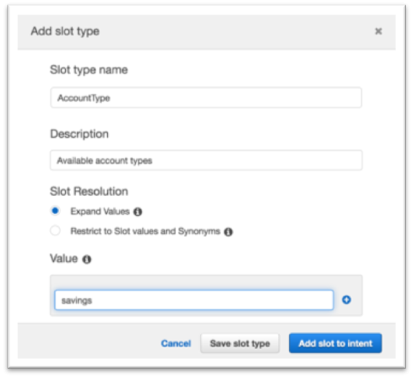

16.	Click “Add slot to intent”
17.	Change the ‘Name’ to “AccountType” so that it matches the slot name that we specified when we created the sample utterences.
18.	Specify “What type of account?” for the ‘Prompt’. This prompt will be used by our bot if the user does not specify an account type when asking a question.

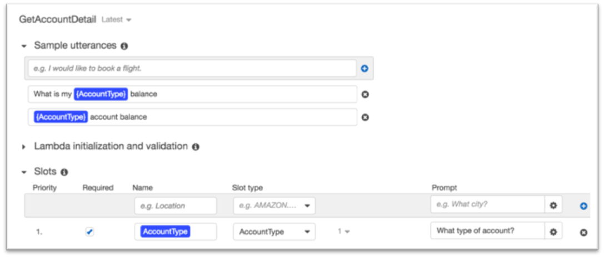

19.	Scroll down and click “Save Intent”
If at any point you made a mistake in the steps above, selecting the “Latest” version of the intent at the top, next to the intent name, will allow you to edit your choices.
20.	Let’s build this simple Bot: Hit the grey Build button at the top right corner. You will be asked for confirmation to build. Click “Build”. 
The build process takes approximately a minute. Once complete, you can ask your bot a question as a way to test it. For example, you could type “what is my checking balance?” in the chat window. At this stage since we have not added in the backend Lambda function, the response will be that the bot is ready for fulfillment. 
Let’s add 2 more intents and one more slot type. 
21.	Click the blue “+” sign next to “Intents” on the left hand side of the page, then click “Create new intent”. 
22.	This intent will allow users to get information on their outstanding home or car loan balance, so set the name to “GetLoanDetail” then click ‘Add’
23.	For sample utterences (the things we expect out users to type/say to our bot to trigger a specific intent/action), add the following phrase then click the blue “+” at the end of the sample utterance box.
•	“Get my {LoanType} loan balance”
24.	Now we’ll create a new slot type which we’ll use to store a response from the user as to whether they are wanting the intent to access their car loan balance or their home loan balance. Click the blue “+” sign next to ‘Slot types’ on the left hand side of the screen
*	For ‘Slot type name’ enter “LoanType” and optionally provide a description
*	Enter the following two options as values:
	**	car
	**	home
25.	Click ‘Add slot to intent’
26.	Change the name of the slot from “slotOne” to “LoanType” 
27.	Provide a prompt (such as “Which loan account?”)
28.	Make sure that the “Required” column is selected

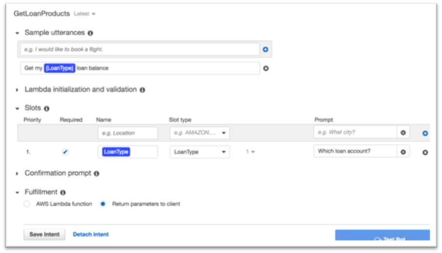

29.	Click ‘Save Intent’
Now we’ll add a final intent to allow users to get more information on the loan products that we have. 
30.	Click the blue “+” sign next to “Intents” on the left hand side of the page, then click “Create new intent”. 
31.	Set the name of the intent to “GetLoanProducts” then click ‘Add’
32.	For sample utterences (the things we expect our users to type/say to our bot to trigger a specific intent/action), add the following two phrases. Make sure not to include punctuation (such as comma’s or question marks).
•	“What is the rate on the {LoanType} loan”
•	“More loan info”
The “More loan info” utterance will be used as a follow-up after a user has asked for information on their outstanding loan balance.
33.	Add a slot (this allows us to get the loan type that the user wants to query) with the following values
•	Name: LoanType
•	Slot Type: LoanType (select from the drop-down list)
•	Prompt: Which loan type?
34.	Click the blue “+” button to the right of the Slots information to add this slot to the intent
35.	Click ‘Save Intent’
36.	Click Build, and click Build again when prompted for confirmation. 
Our bot is almost ready … all it needs now is a smart backend.
 
###	2 Use Lex Import Function to Create a Lex Bot without Manually 
Creating Intents
If you do this, you can skip Section 3 Create the Lex Bot Manually.
1.	Click on Action.
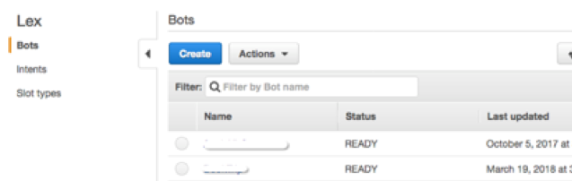 

2.	Click on Import. 
 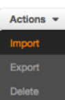 

3.	Choose the zip file. You need to download the file lex-import-personal-banker.json.zip from here https://workshop-public-folder.s3.amazonaws.com/index.html 
4.	Click Import. 
5.	Click Overwrite and Continue if you are not using these slot type.
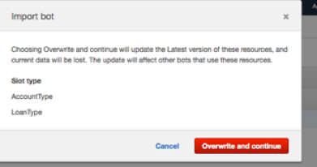 

6.	Click on the bot you just build.
7.	Click on build.
8.	The build process takes approximately a minute. Once complete, you can ask your bot a question as a way to test it. For example, you could type “what is my checking balance?” in the chat window. At this stage since we have not added in the backend Lambda function, the response will be that the bot is ready for fulfillment. 
9.	Then go to Section 3 Create a Lambda function to continue.

###	3 Create Lex Lambda Function

Here we will create a Lambda function that has some Python code to detect the intent name (‘GetAccountDetail’, ‘GetLoanDetail’ or ‘GetLoanProducts’) and to return static values based on the AccountType (checking, saving) or LoanType (car, home) included in the intent. In a real world example we would have already authenticated the user using account linking and would write Python code to do a database lookup for the account balances.  To get a whole picture better, let’s build the function with hard code account balances first and leave authorization to the final step. 

1.	Use the AWS Console to navigate to Lambda.
2.	Click on the orange ‘Create a function’ link under the ‘Getting Started’ section
3.	Select ‘Author from scratch’ option

4.	Let’s give our function the name of “bot-personal-assistant” and optionally provide a description. Feel free to choose a different name.
5.	Choose Python 2.7 as the Runtime
6.	We will ‘Create new role from template’. You can give it a “bot-personal-assistant-lambda-role” role name and leave the policy template empty.

7.	Click create function.
8.	Scroll down to the integrated Coud9 editor on the Lambda console.

9.	Download the lambda function code lex-lambda-personal-banker.py. Copy and paste the code into the inline editor (while making sure to overwrite/delete any template code that is already in the code box). Take a few minutes to review the code. Please note if you named your intents differently, you will have to update the dispatch method accordingly.
10.	We are not going to configure any trigger now, so click ‘Save’ on the top right hand corner of the page. You should see a message like this.
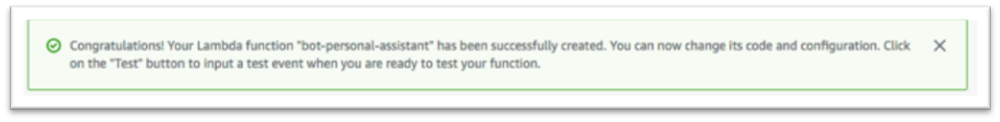 
 
###	4 Link Lex bot with the Lex Lambda function
In this step we will link the three intents we created to the Lambda function. We do this by providing the Lambda function as the method that contains the business logic used to ‘fulfill’ the users requests. Once this is done (and the bot rebuilt), when a user specifies an intent (such as ‘what is my checking account balance’), Lex will call our Lambda function and pass it the intent name (‘GetAccountDetail’) and the slot value (‘checking’). 
To do this, we go back to the Lex Console https://console.aws.amazon.com/lex  

1.	Click on Personal Banker
2.	Enure the ‘GetAccountDetail’ intent is selected
3.	Make sure that the ‘Latest’ version is selected

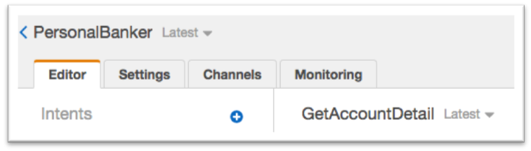 

4.	Scroll down to ‘Fulfillment’, select “AWS Lambda function”, choose “bot-personal-assistant” and click “OK” in the popup warning window which opens. It indicates you are giving Lex the permission to run this Lambda function.
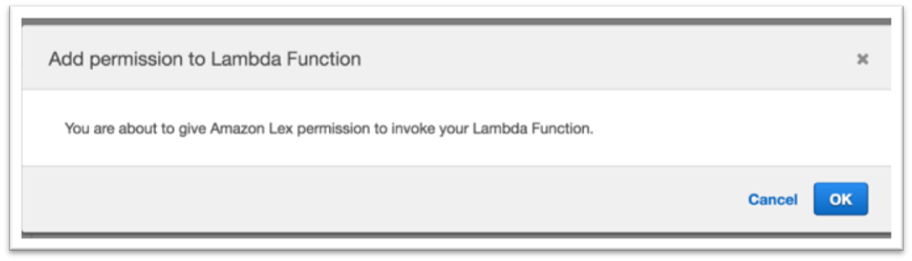

5.	Click Save intent.
6.	Repeat the above steps 4, 5 and 6 for intents GetLoanDetail and GetLoanProducts
7.	Click “Build” and then click “Build” again on the confirmation screen.

###	5 Chat with Lex Bot
1.	Start by typing “What is my checking account balance?” (or press the microphone button and ask your question using your computer mic).
2.	You should get an answer. 
3.	Then type “What is my home loan balance?” (or ask using your mic)
•	Notice that Lex is able to recognize that you are wanting to trigger the GetLoanDetail intent even though what you typed, “What is my home loan balance?”, did not exactly match the sample utterance that you configured the intent with which was “Get my {LoanType} loan balance”. 
4.	Type ‘more loan info’ and see how Lex returns information on the current, new home loan rate. In this case, because we didn’t set the ‘slot’ to be required, we didn’t need to specify whether we were looking for more information on car or home loans … Lex returned information on the loan type (in this case, home) that we had just asked about.
 

###	6 Publish the Lex Bot
1.	Go to Setting tab. 
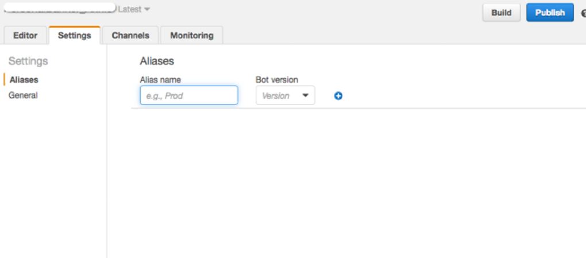

2.	Enter UAT in Alias Name.
3.	Choose Latest as Bot version.
4.	Click Publish.
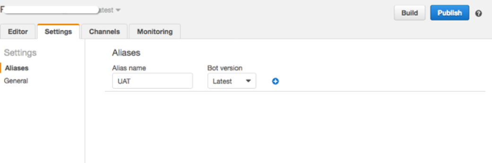

5.	Enter UAT and click Publish.
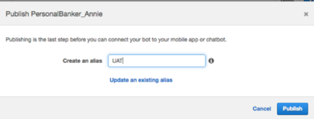 

###	7 Bring Lex Bot to Web
In this lab, you will create a web interface that can be integrated with your Lex bot. This interface allows you to interact with a Lex bot directly from a browser using text or voice. You will be using AWS CloudFormation to create this web interface.

1.	Go to https://github.com/awslabs/aws-lex-web-ui 
2.	Go to Getting Started section, find Launch Stack. Click on it.
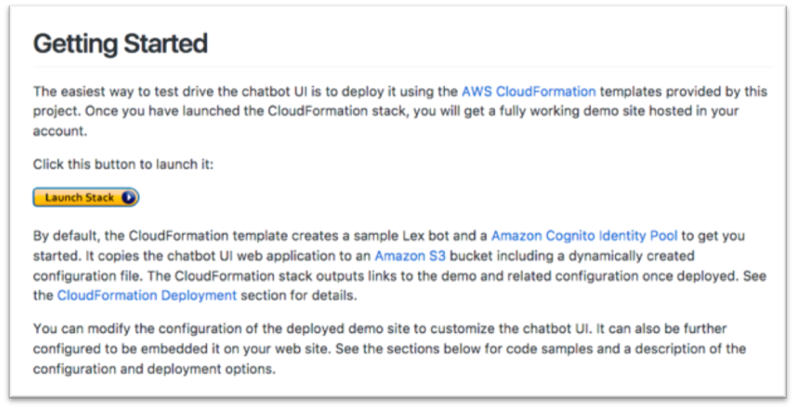
 
3.	You will be brought to CloudFormation service page. If you are asked to login to AWS console, do so.
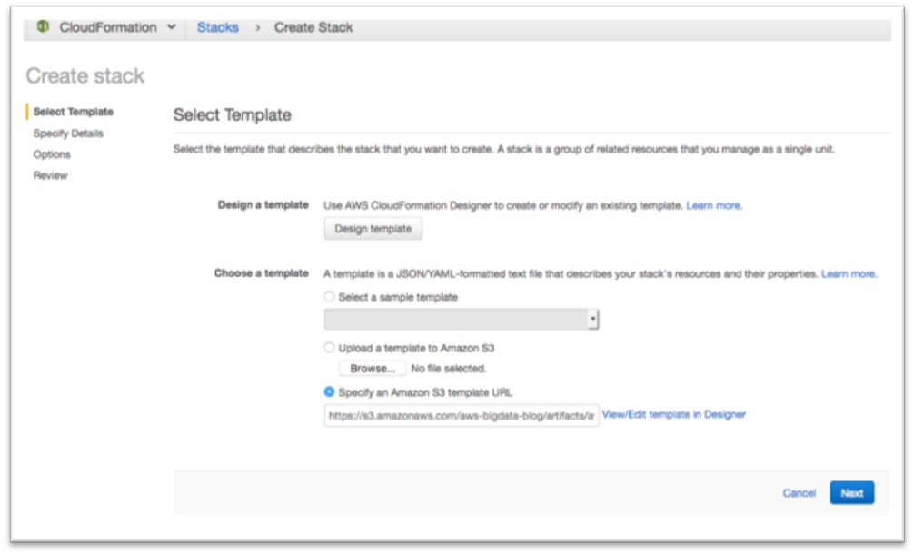

4.	Click on Next.
5.	Scroll down. You need to change a few parameters here.
*	a.	Enter “PersonalBanker” into the BotName. This must be the exact name of your bot. 
*	b.	Delete the text in WebAppConfBotInitialText field, and enter “You can ask me for your account info. Just type "What is my checking account balance" or click on the mic and say it.”
*	c.	Delete the text in WebAppConfBotInitialSpeech field, and enter “Say "What is my checking account balance" to get started.”
*	d.	Delete the text in WebAppConfToolbarTitle field, and enter “Personal Banker”.
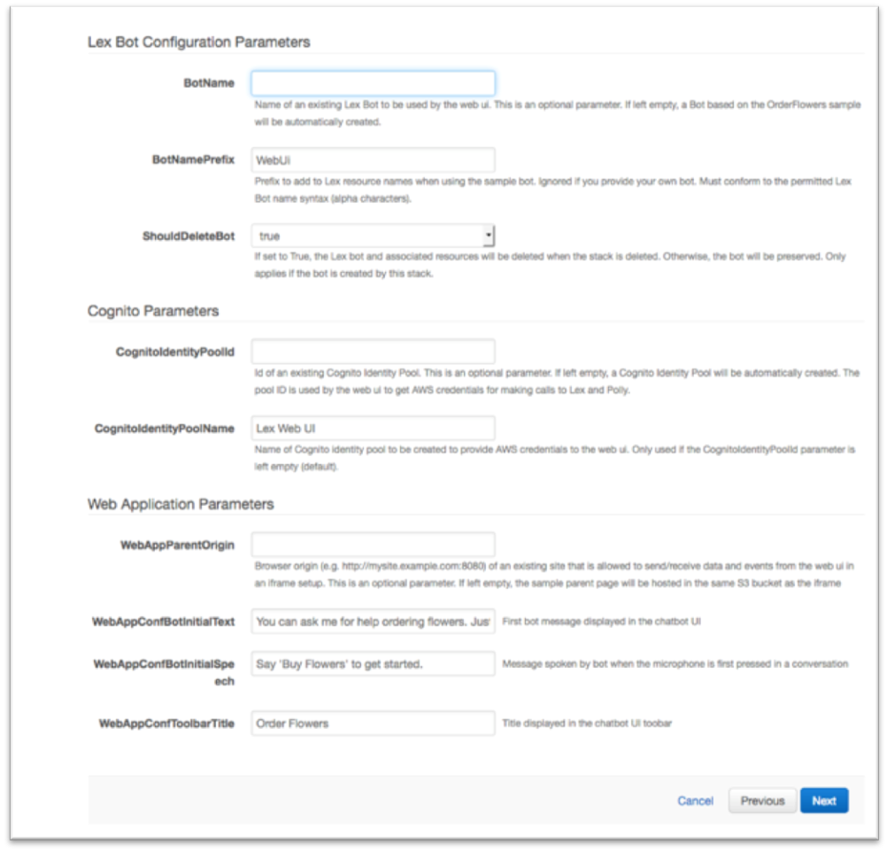

6.	Click on Next.
7.	Click on Next again.
8.	Tick “I acknowledge that AWS CloudFormation might create IAM resources with custom names.” And click on Create.
9.	It may take a few minutes. Click on the refresh button on the top right corner to see the progress. 
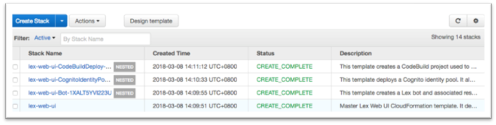

10.	Once the stacks are created. The status column will show green text. 
11.	Click on lex-web-ui, go to the Output section. You need to expand this section if needed.

12.	Click on WebAppUrl.
13.	Adjust your browser to an appropriate size and start chatting with your bot or speak to it.

###	8 Export the Bot to Alexa Skills Kit / Lex Format
1.	Close the pop up window. Click on the Left Arrow on the top left corner.
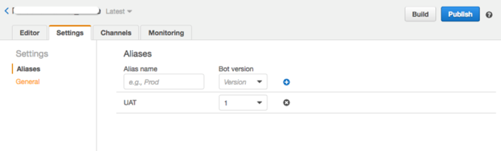

2.	Select your bot and click on Action.
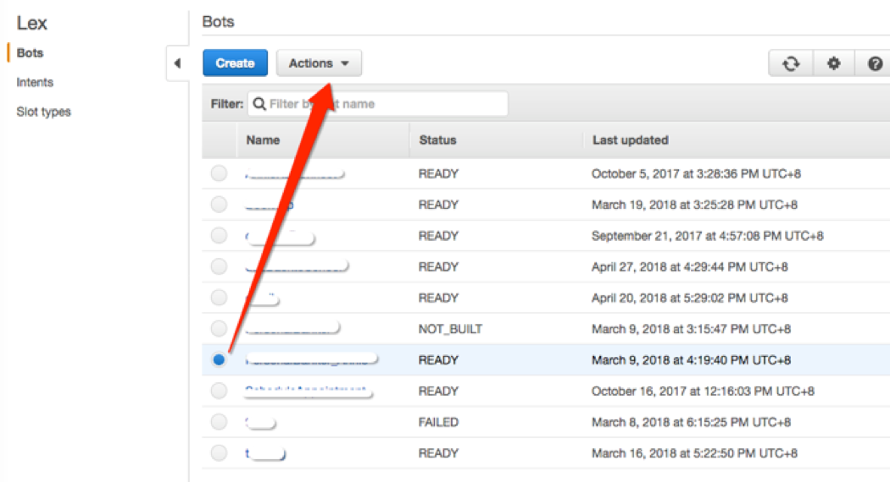

3.	Click on Export.
4.	Choose the bot version and platform as ASK. Click on Export. Save the file.
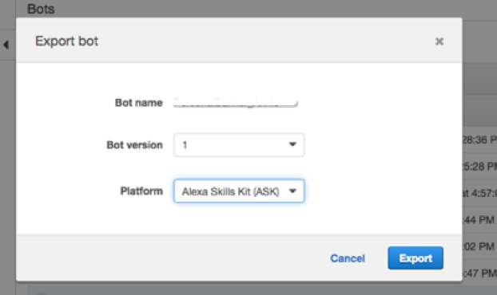

5.	Unzip the downloaded file and you will get the .json file. This will be used for Alexa Skill later. You can also export it as Lex format. The exported file can be used to replicate the same bot in another account.

###	9 Import Lex Intents to Alexa Voice Interface 

1.	Go to the Amazon Developer Portal https://developer.amazon.com . In the top-right corner of the screen, click the "Sign In" button. (If you don't already have an account, you will be able to create a new one for free.) 
2.	Once you have signed in, move your mouse over the Developer Console text at the top of the screen and Select the Skills Link. 
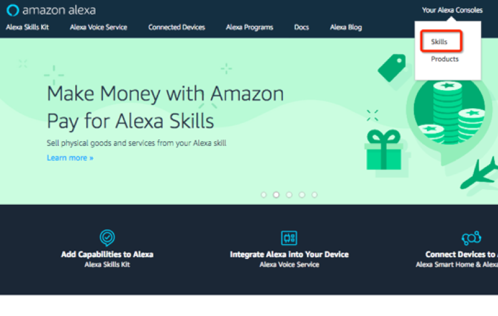

3.	From the Alexa Skills Console select the Create Skill button near the top-right of the list of your Alexa Skills.  
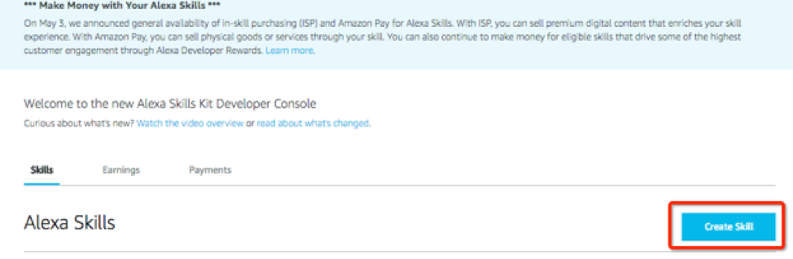

4.	Give your new skill a Name. This is the name that will be shown in the Alexa Skills Store, and the name your users will refer to. Also change the locale if so desired. Push Next.  
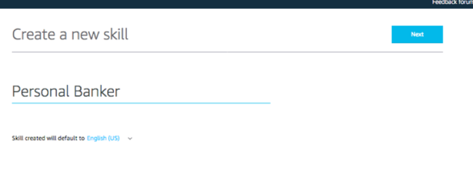

5.	Select the Custom model button to add it to your skill, and select the Create Skill button at the top right.
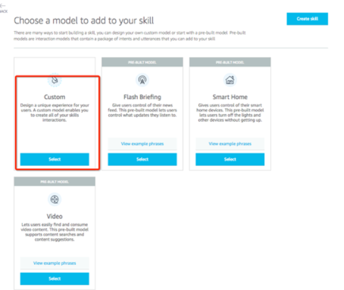 

6.	You can choose to build the Interaction Model for your skill by adding intents, slots, etc, manully, which we have already done in Lex. So we are going to re-use our Lex intents, slots. 
7.	On the left hand navigation panel, select the JSON Editor tab under Interaction Model. In the textfield provided, replace code line 5 to 23 with the code in the zip file exported from Lex. Follow the instruction below.
*	a.	Select code line 5 to 23, delete it.
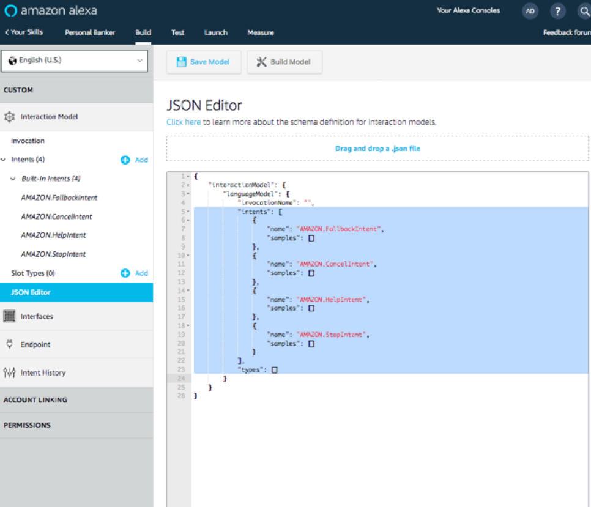

*	b.	Open the .zip file you export from Lex in Visual Studio or any other text edit file. (If you find it is hard to follow, replace the entire code in the textfield provided with alexa-developer-console-personal-banker.json. Then you can skip step c, d, e, and jump to step 8.)
*	c.	Select the highlighted part below. Copy it. 
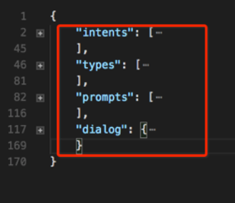 

*	d.	Paste it back to the Alexa console after line 4.
*	e.	Input a innovation name as shown below. 
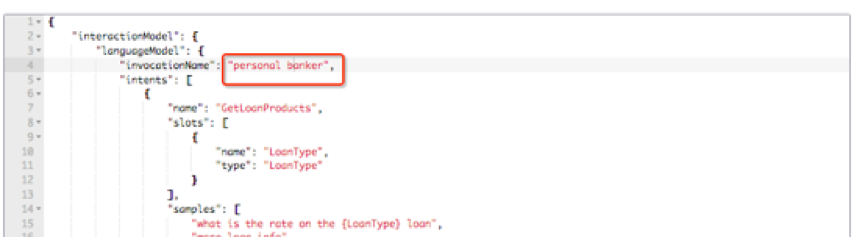

8.	Click on Save Model and then Build Model. 
9.	Note: You should notice that Intents and Slot Types will auto populate based on the JSON Interaction Model that you have now applied to your skill. 
10.	If your interaction model builds successfully, proceed to the next step. If not, you should see an error. Try to resolve the errors. In our next step of this guide, we will be creating our Lambda function in the AWS developer console, but keep this browser tab open, because we will be returning here.

###	10 Create a Lambda function for Alexa
1.	Go to http://aws.amazon.com and sign in to the console.
2.	Navigate to Lambda.
3.	Click the orange "Create function" button. It should be near the top of your screen.
4.	There are three boxes labeled "Author from scratch", "Blueprints" and "Serverless Application Repository". Click the radio button in the box titled "Serverless Application Repository" We have created an application in the repository as a shortcut to getting everything set up for your skill.
5.	Enter fact to search for the application repository named alexa-skills-kit-nodejs-factskill. Enter the full name into the serach box if you need to narrow the search results.
6.	Click on the application. This template will create the Lambda function, grant the Alexa Skills Kit permission to invoke it, and set up an IAM role for you. It will also add the code from this GitHub repo and include the required dependencies so that you don't have to upload them yourself.
7.	Change the application name and then Click the deploy button at the bottom of the page.
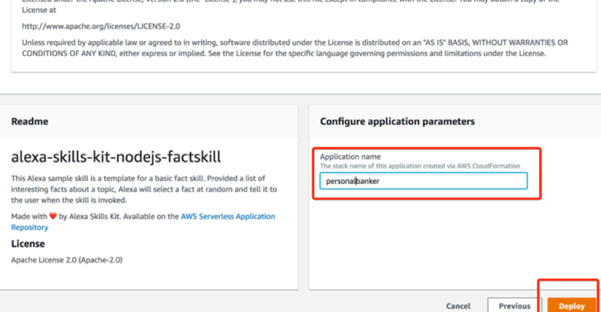 
8.	Wait for the status of all resources to change to CREATE_COMPLETE
9.	Click the Test App button to go to the Lambda console.
10.	Open the function that was just created by clicking on it.
11.	Scroll down the page until you see a section called Function code.
12.	Replace it with the code in alexa-lambda-personal-banker.js, be sure to click "Save".
13.	You should see the Amazon Resource Name (ARN) a unique identifier for this function in the top right corner of the page. Copy the ARN value for this Lambda function for use in the next section of the guide.
14.	Go back to the Amazon Developer Portal https://developer.amazon.com. You may still have a browser tab open if you follow this tutorial.
15.	Select the Endpoint tab on the left side navigation panel.
16.	Select the "AWS Lambda ARN" option for your endpoint. You have the ability to host your code anywhere that you would like, but for the purposes of simplicity and frugality, we are using AWS Lambda.
17.	Paste your Lambda's ARN (Amazon Resource Name) into the textbox provided for Default Region.
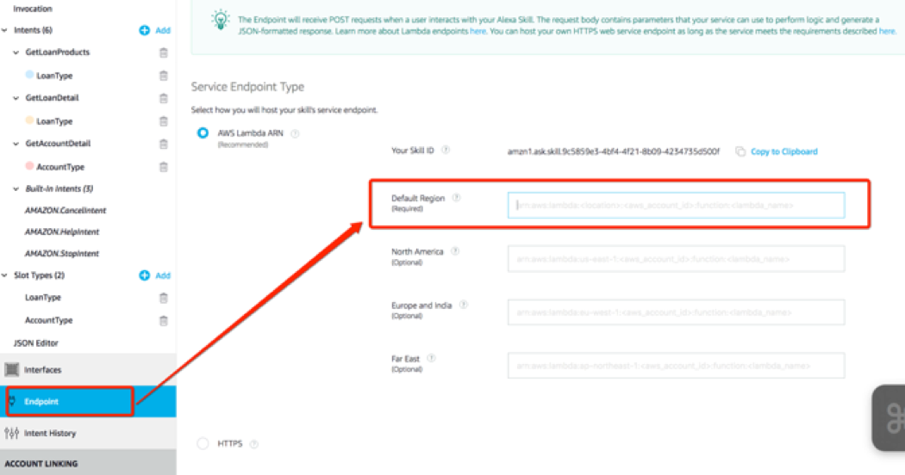 
18.	Click the Save Endpoints button at the top of the main panel.
19.	Click on Test.
20.	Make sure test is enabled.
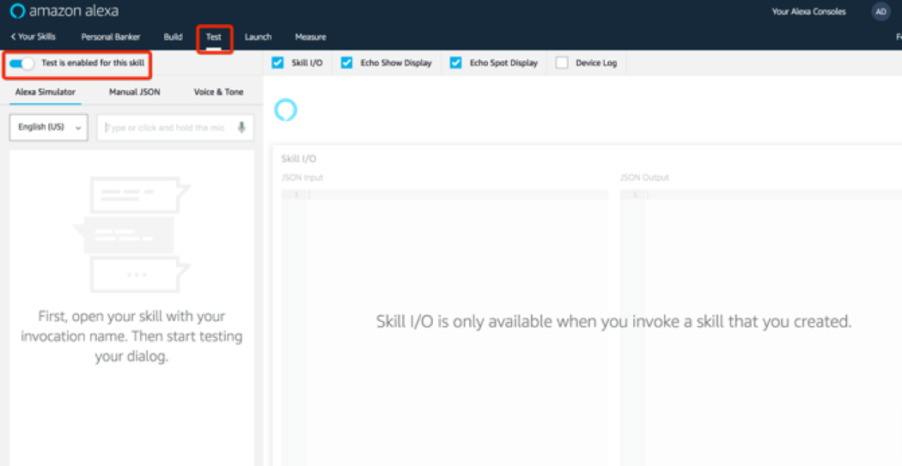

21.	Type Open Personal Banker to start.
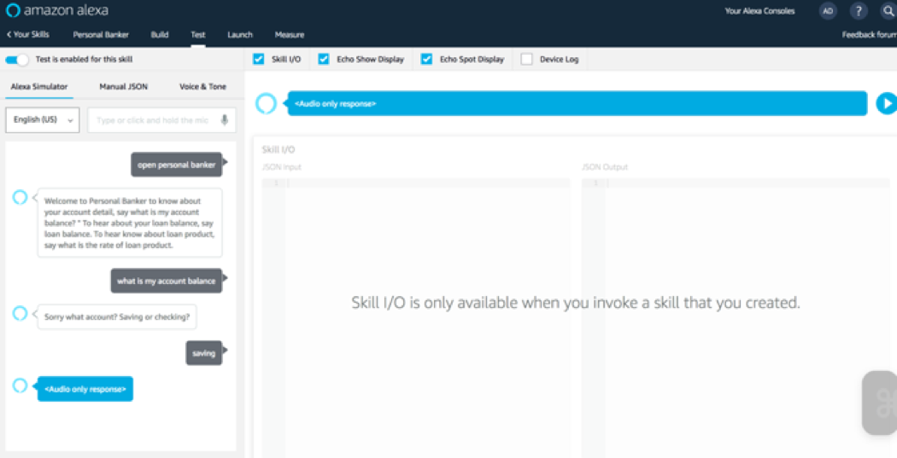
 

###	11 Add Account Linking For Alexa
In this section, we will use cognito user pool for Alexa’s account linking function.

1.	Open AWS cognito console and create a new user pool. Use default settings and name the pool using your own name. You could custom your user attributes though, for example, you could revise the password length and characters requirement, and whether the user have to set a new password after registration. 
2.	Create an app client.
 

3.	Return to Alexa developer console, on the left tab, choose [account linking] and get all the redirect addresses.
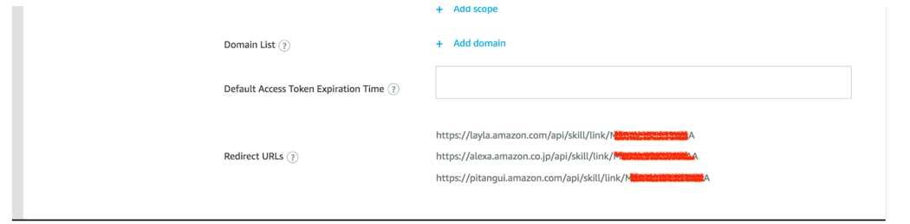

4.	Confiture cognito app client. Add the addresses in step 3 to Callback URLs ,separated by commas ‘,’. Don’t forget to save it !
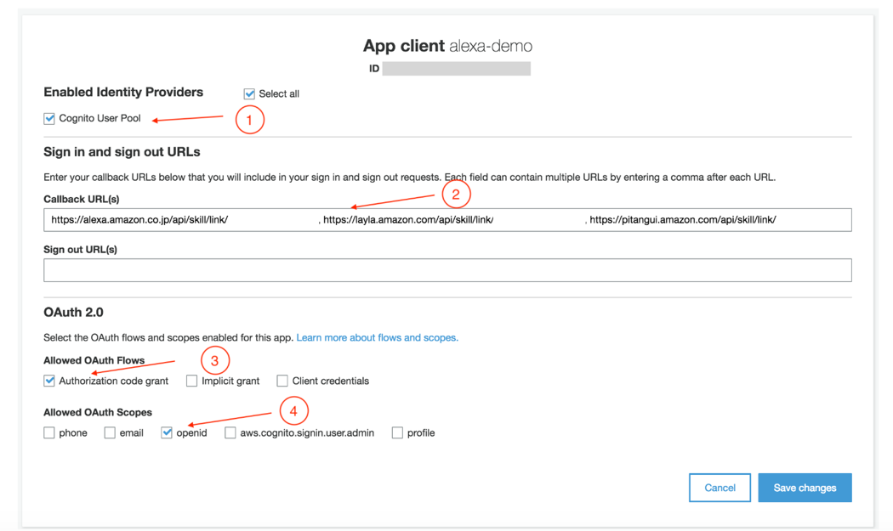

5.	Custom your own domain. You have to have an unique domain in your region. Type a name and check the availability for this domain, if it already exists, choose another one.
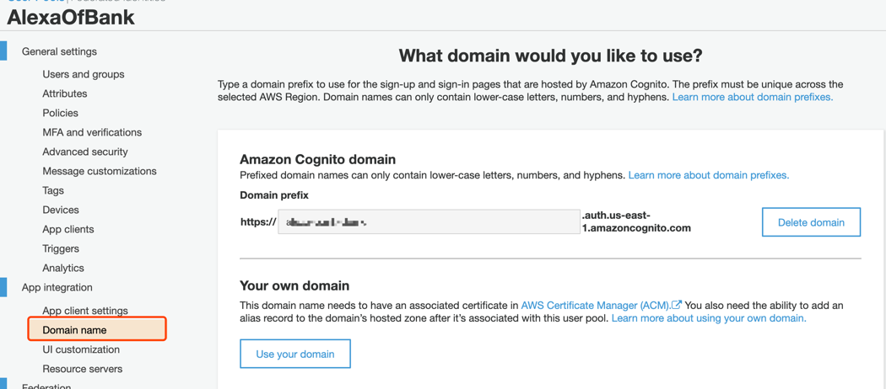 

6.	Open account linking in alexa developer console. The second option, whether it allow users to enable skill without linking depends on you. If your skill includes no personal information, for example, your users just ask for some restaurants locations, you could enable it. But if it concerns banking or more personal and sensentive operations, you better disable it.
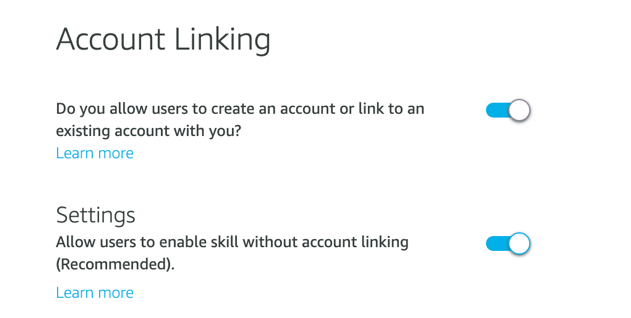 

7.	Enable account linking function in Alexa console and configure the below infos. All of the information could be found in cognito user pool – app integration -app client page. 
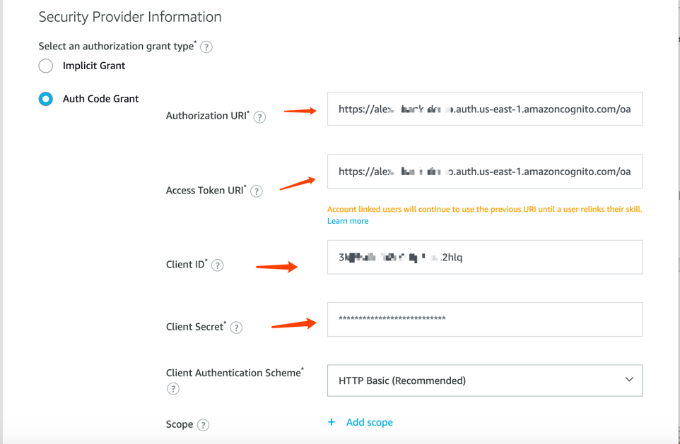
 
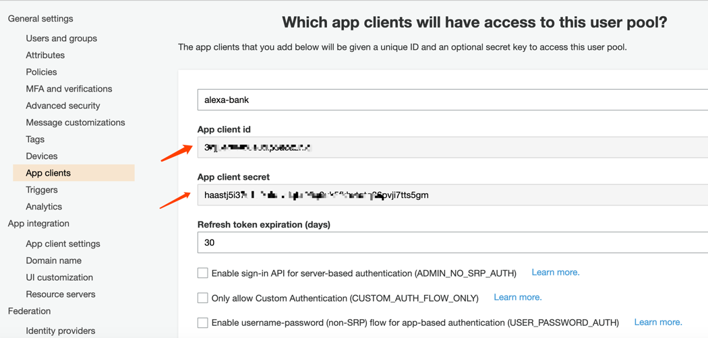

8.	Add users.  You could either use cognito front page to register a new user or you could simply configure a new user in the cognito console [users and groups].
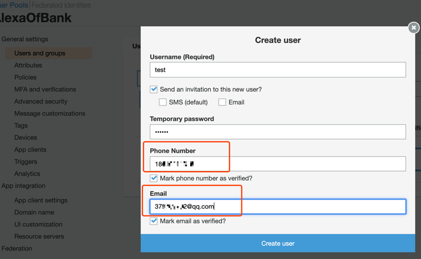 

9.	Finish the account linking on your Alexa APP.  Open Alexa APP and choose your skill and enable it (if it’s already enabled, you will need to re-enable it) . Click SETTINGS  and choose account linking.  In the new page, input your username and password.
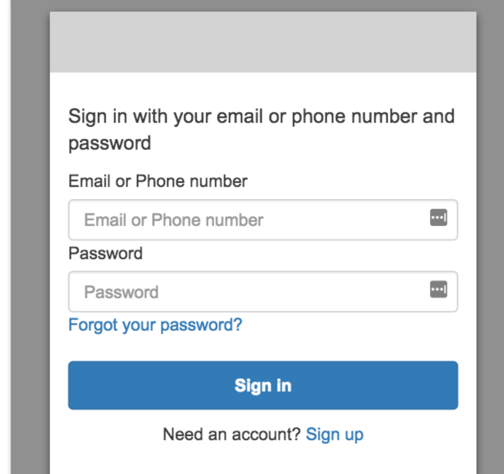

You will see that after login in, the account has been succefully linked.  You may revise your codes now to change all hard-code account balances to query from DynamoDB first. DynamoDB maintains the mapping relationship of cognito identityID and account balance or other information for you to add. We will skip this part.
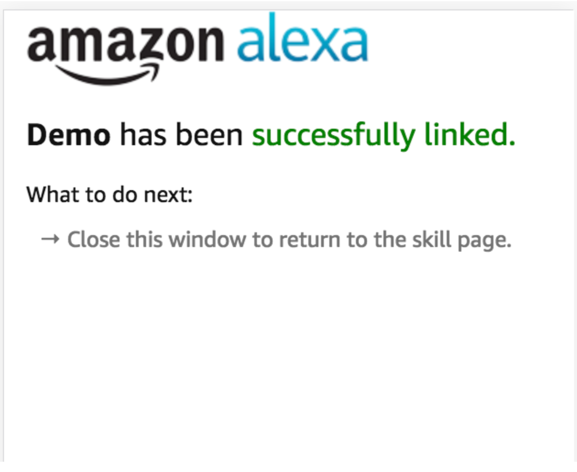

###	Optional Challenge – Add SMS Notification to Lex 

In this lab, you will learn the basic to configure the Lex bot to send SMS to anybody. 

1.	Just like the previous section, go Lex, open the bot you just created, we will create a new intent: SendToMyMobile. Click the “Create Intent” button.
2.	Our next intent enables the user to send their balance info to their phone number, so name this intent “SendToMyMobile” then click “Add”.
3.	Now want to provide samples of what our user would type or say to perform this action. Make sure you do not add a question mark at the end of the phrase. 
•	balance to my mobile
4.	Next, we will define two new slots to process this request this time. 
5.	For ‘Slot type name’, enter ‘AccountType’, select ‘AccountType’ in the ‘Slot type’ dropdown. In the prompt, enter ‘for which account type?’. Once done, hit the blue “+” sign.
6.	Enter ‘PhoneNumber’ in the next ‘Slot type name’, select ‘AMAZON.PhoneNumber’ in the ‘Slot type’. In the prompt, enter ‘what is your phone number’. Once done, hit the blue “+” sign again.  
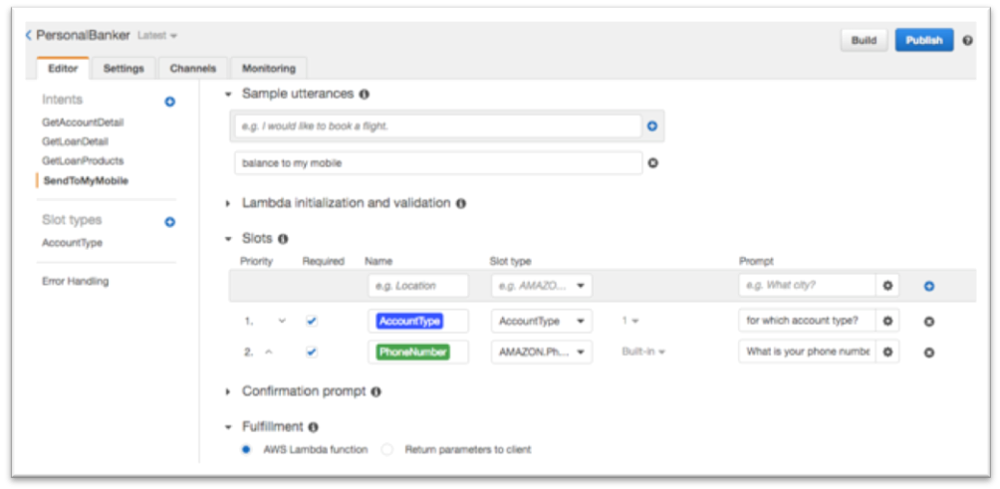

7.	Scroll down and click “Save Intent”.
8.	Next, we will create the lambda function. Download the code lex-lambda-send-sms.py. And follow the steps in the previous section Create a Lambda function and give the function name ‘sendLexSms’.
9.	Go back to your Personal Banker in  the Lex Console.
10.	Make sure you select the correct “SendToMyMobile” Intent.
11.	Scroll down to ‘Fulfillment’, select “AWS Lambda function’, choose ‘sendLexSms’ and click ‘Ok’.
12.	Next, we will create a custom IAM policy. Remember that you create a ‘Lex’ IAM Role while creating the first Lambda function. 
13.	Go to IAM.
14.	Select Roles and find the ‘Lex’ IAM role.
15.	Click on “Add inline policy” at the bottom right of the table.
16.	And copy the IAM policy from this file lex-sms-iam-incline-policy.json and paste them in this IAM policy. 
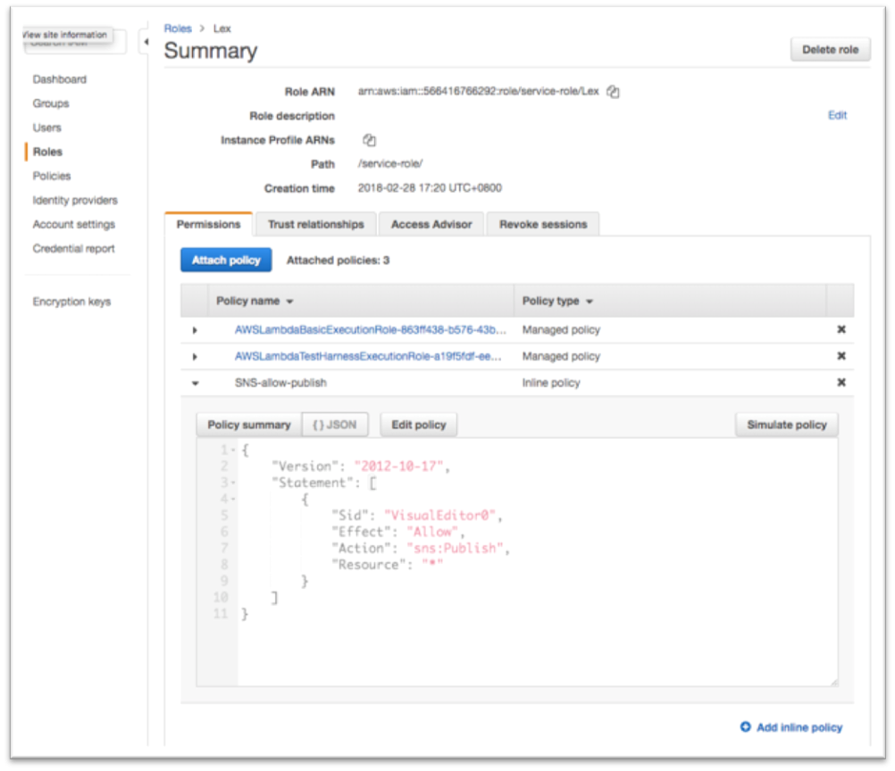
17.	Once you are done in IAM, go back to Lex Console.
18.	Click “Build” and then click “Build” again on the confirmation screen.
19.	Time to test our new bot. And start by entering “Get balance to my mobile number”. When you are prompted to key in your mobile, enter your 8 digit phone number (without +65). 
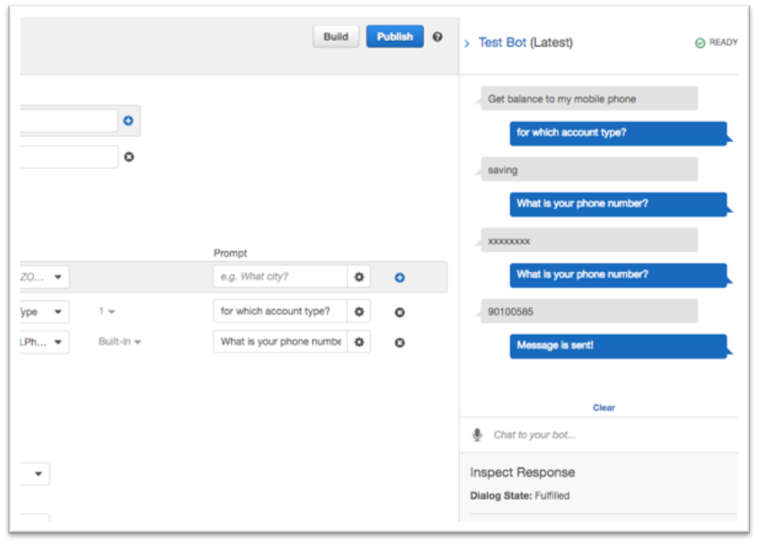

##	Conclusion
In this lab you have learned the basic operations to manage a Lex bot and Alexa skill. Time to create your own bot and Alexa skill. 

##	Resources
*	The files you need for this workshop are all here 
https://workshop-public-folder.s3.amazonaws.com/index.html
*	You can find Speech Synthesis Markup Language (SSML) Reference here https://developer.amazon.com/docs/custom-skills/speech-synthesis-markup-language-ssml-reference.html
*	You can find Alexa github here https://github.com/alexa/

