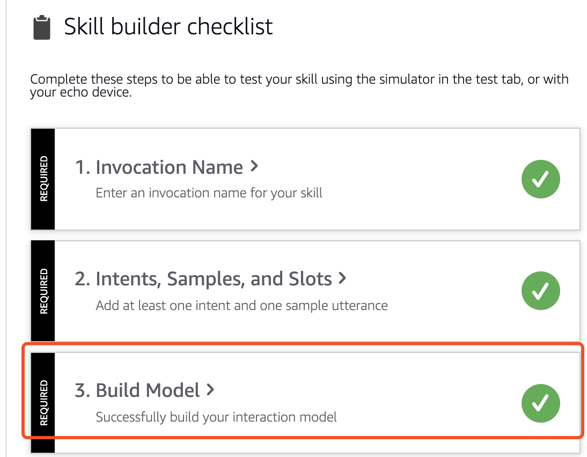
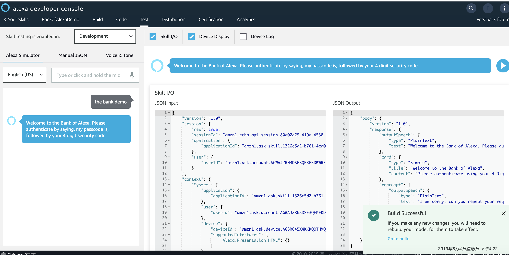

# 快速构建Alexa Skill

本文介绍如何利用AWS资源快速构建自己的Alexa skill。演示了一个与银行交互的demo，实现的基本功能为：greeting，列举账号，查询余额。 用的服务主要有API Gateway, lambda, DynamoDB等。


# 先决条件
1. 注册Alexa的developer。https://developer.amazon.com/alexa/console/ask/displays
2. 注册AWS账号

## 架构图


## 详细步骤

### 0. 登录Alexa developer console新建skill   

Alexa提供了多种模块供选择，这里我们选择custom自定义。可以看到构建一个alexa skill主要分为五步，按照这五步顺序执行即可。以下篇幅将围绕这五点做展开。


### 1. Invocation Name

即唤醒词。Alexa只有在听到Invocation name后才会唤醒当前skill。这里我的invocation name为bank demo


### 2. Intents, Samples, and Slots

Intents为意图，即这个skill能提供什么功能。在我此次的demo当中，我们主要提供三个功能，greeting（简述天气情况），列举账号和查询余额。其中greeting不需要认证，列举账号和查询余额为私人功能，只有在用户验证身份后才可以执行。认证作为一个单独的功能，因此我们总共需要构建4个intent。所有的intent我们都通过lambda function来定义具体实现。每个构建response都包含标准speech返回以及card_response(带屏设备可以展示的文字以及title)。   

#### （1）Greeting: SayHelloIntent

在左边tab栏当中add Intent。Sample Utterances为此intent的唤醒词。可自行定义，如：say hello, introduce yourself等。考虑最简单的情况，无需数据交互，直接定义一个lambda函数返回"hello world"，在endpoint当中制定这个lambda的ARN。Alexa就可以在bank demo唤醒后，听到say hello返回"hello world"。   

如果我们希望实现一个更复杂一点的功能，即让Alexa告诉我们当前城市的天气状况。函数定义如下。在lambda当中添加环境变量WEATHER_LOCATION和OPENWEATHER_APIKEY （APIKEY在openweathermap官网下获取），lambda的代码如下

```
    # utterance "..introduce yourself"
    def say_introduction(self, intent, session):

        requests.packages.urllib3.disable_warnings()

        location = os.environ['WEATHER_LOCATION']  # can be any capital city
        r = requests.get(
            "http://api.openweathermap.org/data/2.5/weather?q={0}&appid={1}".format(location,
                                                                                    os.environ['OPENWEATHER_APIKEY']),
            verify=False)
        weather = r.json()

        temp_raw = weather["main"]["temp"]  # in Kelvin
        temp_clean = round(pytemperature.k2c(temp_raw), 1)

        session_attributes = {}
        day = date.today().strftime("%A")
        card_title = "Introducing myself"

        message = "Hello! Thank you for allowing me to introduce myself. My name is Alexa and it's a pleasure to meet you today in {0}, and I hope you are having a fantastic {1}. In case you were wondering, the weather outside is currently {2} degrees celcius.".format(
            location, day, temp_clean)

        card_output = "Greetings! I'm the Bank of Alexa"
        speech_output = message
        # If the user either does not reply to the welcome message or says something
        # that is not understood, they will be prompted again with this text.
        reprompt_text = "I am sorry, can you repeat your request?"
        should_end_session = True

        speechlet = self._build_speechlet_response(
            card_title, card_output, speech_output, reprompt_text,
            should_end_session)

        return (self._build_response(session_attributes, speechlet))

```

#### （2）authenticate: AuthenticateIntent
在左边tab栏当中add Intent，AuthenticateIntent配置如下, 包括添加utterances，以及为number类型的Intent Slots 


将passcode作为一个lambda的环境变量AUTHENTICATION_PASSCODE，模拟认证的过程。当用户的输入passcode与环境变量一致时，才可以获取自己的余额。现实生活中实际这一步可以结合cognito通过account linking的功能来实现，用ddb存储username，password以及account余额之间的关系等。核心代码如下：
```

            if 'passCode' in intent['slots']:
                passCode = str(intent['slots']['passCode']['value'])
                print ("user passed passCode: {0}".format(passCode))
                # change | to do cloudformation set env var on lambda
                myPassCode = os.environ['AUTHENTICATION_PASSCODE']
                # change | set session data in dynamodb
                if passCode == myPassCode:
                    # this session attribute is used later to authenticate requests
                    session_attributes = {
                        "passCode": passCode
                    }
                    message = "Thank you. You have successfully authenticated and may now interact with your account."
                    card_output = "Successfully Authenticated."
                else:
                    message = "Sorry, that is not a valid passcode. Please try authenticating again by saying, my passcode is, followed by your 4 digit security code."
                    card_output = "Incorrect Passcode."
            speech_output = message
```
#### （3）与账户之间的交互1: ListAccountIntent
这一步demo的是实际终端用户与alexa做交互，用户可以询问alexa它个人账户下有哪些账户以及他们对应的余额。同一个客户可能会有多个账户类型，比如savings,credit等等。
因此首先我们需要一个变量类型，为account_type, 列出他的可能的值，以及对应给哪个intent去使用。


接着我们添加对应的intent


lambda核心函数如下： 
实际生产中，需要结合dynamoDB，列出此人账户下的所有余额，这里lazy模式直接写死。

```
    # utterance ".. what accounts do I have?"
    def _list_account(self, intent, session):
        session_attributes = session["attributes"]
        card_title = "Listing my accounts"
        message = "You have a debit, mortgage, credit and a savings account. " #lazy
        card_output = "Debit, Mortage, Credit and Savings"
        should_end_session = False
        # should really get list from slots, not hard coding..        
        speech_output = message
        reprompt_text = "I am sorry, I didnt catch that, can you please repeat your request"

        speechlet = self._build_speechlet_response(
            card_title, card_output, speech_output, reprompt_text,
            should_end_session)

        return (self._build_response(session_attributes, speechlet))
```

#### （4）与账户之间的交互2: BalanceIntent


这里在业务的实现逻辑上，是需要与dynamoDB做交互，先取出某个account对应的余额然后给出response。请先按照[此篇blog](https://quickstart.org.cn/database/api-gateway-proxy-for-ddb.html)配置好dynamoDB和API gateway，然后将API Gateway的endpoint作为lambda的环境变量存储起来。lambda核心代码如下：
```        
        account_summary = requests.get(os.environ['BANKOFALEXA_APIGW'])
        valid_types = [x['account_type']['S'] for x in account_summary]
        
        try:
            if 'Account' in intent['slots']:
                account_type = intent['slots']['Account']['value']

                if account_type in valid_types:
                    for acc in account_summary:
                        if account_type == acc['account_type']['S']:
                            balance = float(acc['balance']['S'])
                            balance_arr = self._format_currency(balance)
                            p = inflect.engine()
                            message = "You have %s dollars and %s cents in your %s account." % (p.number_to_words(balance_arr[0]), balance_arr[1], account_type)
                            speech_output = message
                            card_output = message
                            reprompt_text = "You can ask me a balance to retrieve by saying for example, What is my savings account balance?"
                else: # when value given foro account type does not match existing intent slot values
                    message = "I'm sorry, I was unable to detect the type of account you are after. I can support debit, mortgage, credit and savings"
                    card_output = "Unable to detect valid account type"
                    speech_output =  message
                    reprompt_text =  "I'm sorry, I was unable to detect the type of account you are after. I can support debit, mortgage, credit and savings"
```


#### （5）与账户之间的交互3: 更新余额

如果要添加更新的操作，可以如下配置。在实际真实场景中，无法直接通过这样的方式更新余额，以下仅demo post请求的处理方式，但实际可以通过模拟转账来实现。
配置如下


mapping table配置如下：

```
{ 
    "TableName": "xxx",
    "Item": {
	"account_type": {
            "S": "$input.path('$.account_type')"
            },
        "balance": {
            "S": "$input.path('$.balance')"
            }
        }
}
```
lambda核心代码

```
    client = boto3.client("dynamodb","us-east-1")
    myKey = {'account_type': {"S": str(payload["account_type"])}}
    myVal = {':b': {"S": str(payload["balance"])}}
    response = client.update_item(                                                                           
        TableName = "BankOfAlexa",                                                                                 
        Key = myKey,                                                                                                
        UpdateExpression = "SET balance = :b",                                                                     
        ExpressionAttributeValues=myVal                                                                            
    ) 
    return (response)
```

test时，request body输入数据即可。如

```
{ 
    "account_type" : "savings",
    "balance" : 1950.21
}
```

注：完整的lambda函数可在sample code当中下载。

### 3. building model
点击building model



### 4. 设置Endpoint
将刚才的lambda信息配置到alexa endpoint当中


### 5. Test
可以点击test页面验证目前model是否work，除了文字的方式，也可以通过长按mic语音输入的方式来验证。


同时，如果有alexa app（必须在海外apple store里面才可以下载，china apple store暂不支持），登录账号可以在my skills里面看到此skill。


## 参考连接    

https://docs.aws.amazon.com/zh_cn/apigateway/latest/developerguide/api-gateway-create-api-step-by-step.html    
https://aws.amazon.com/cn/blogs/compute/using-amazon-api-gateway-as-a-proxy-for-dynamodb/   


   

  
   

   


