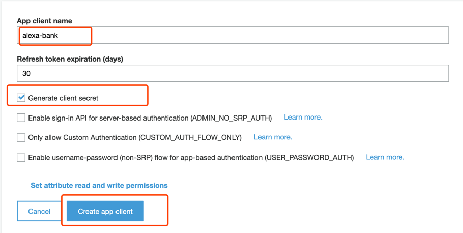
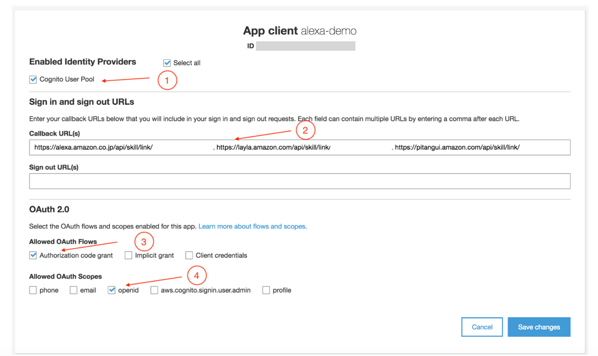
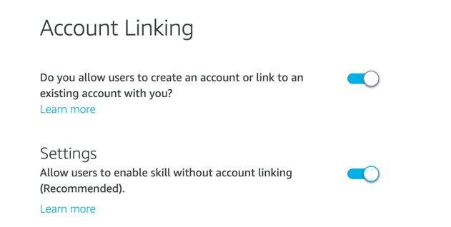
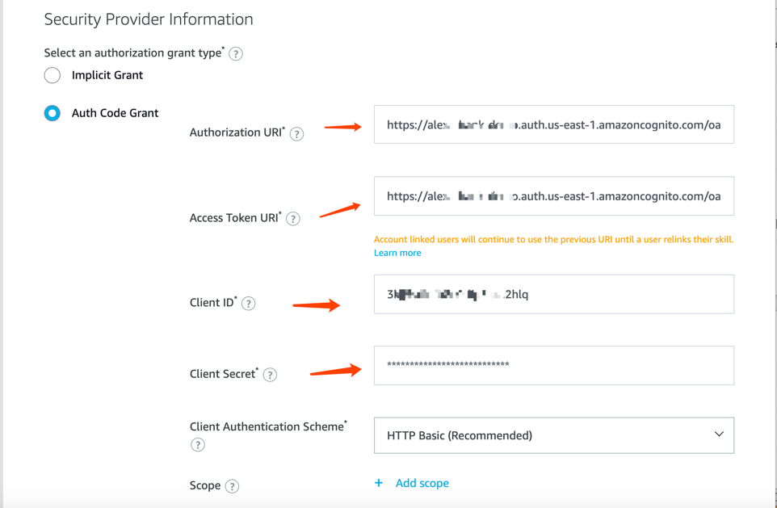
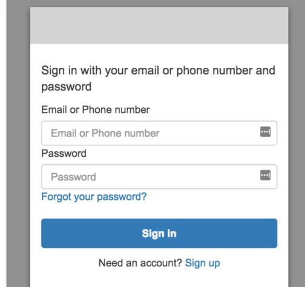

#	Add Account Linking For Alexa

##	Add Account Linking For Alexa

In this section, we will use cognito user pool for Alexa’s account linking function.

1.	Open AWS cognito console and create a new user pool. Use default settings and name the pool using your own name. You could custom your user attributes though, for example, you could revise the password length and characters requirement, and whether the user have to set a new password after registration. 
2.	Create an app client.
 

3.	Return to Alexa developer console, on the left tab, choose [account linking] and get all the redirect addresses.

4.	Confiture cognito app client. Add the addresses in step 3 to Callback URLs ,separated by commas ‘,’. Don’t forget to save it !

5.	Custom your own domain. You have to have an unique domain in your region. Type a name and check the availability for this domain, if it already exists, choose another one. We will use the domain name later.
 

6.	Open account linking in alexa developer console. The second option, whether it allow users to enable skill without linking depends on you. If your skill includes no personal information, for example, your users just ask for some restaurants locations, you could enable it. But if it concerns banking or more personal and sensentive operations, you better disable it.
 

7.	Enable account linking function in Alexa console and configure the below infos. 
*	Authorization URI: < your-custom-domain-name >/oauth2/authorize
*	Access Toekn URI: < your-custom-domain-name >/oauth2/token    

The rest of the information could be found in cognito user pool – app integration -app client page. 

 

8.	Add users.  You could either use cognito front page to register a new user or you could simply configure a new user in the cognito console [users and groups]. Please note that the mobile phone should start with the natianal code for example +86 for China users.
 

9.	Open Alexa APP on your phone (the Alexa APP must be downlowded using global Apple Store accounts). Sign in using your Alexa developer's account, NOT AMAZON.com ACCOUNT.

10. Choose skill tab.

11. Choose your skill and **enable it to use** (if it’s already enabled, you may need to re-enable it in case it doesn't work) . 

12. Click SETTINGS.   

13. choose account linking

14.	In the new page, input your username and password.

15. You will see that after login in, the account has been successfully linked.  You may revise your codes now to change all hard-code account balances to query from DynamoDB first. DynamoDB maintains the mapping relationship of cognito identityID and account balance or other information for you to add. We will skip this part.

