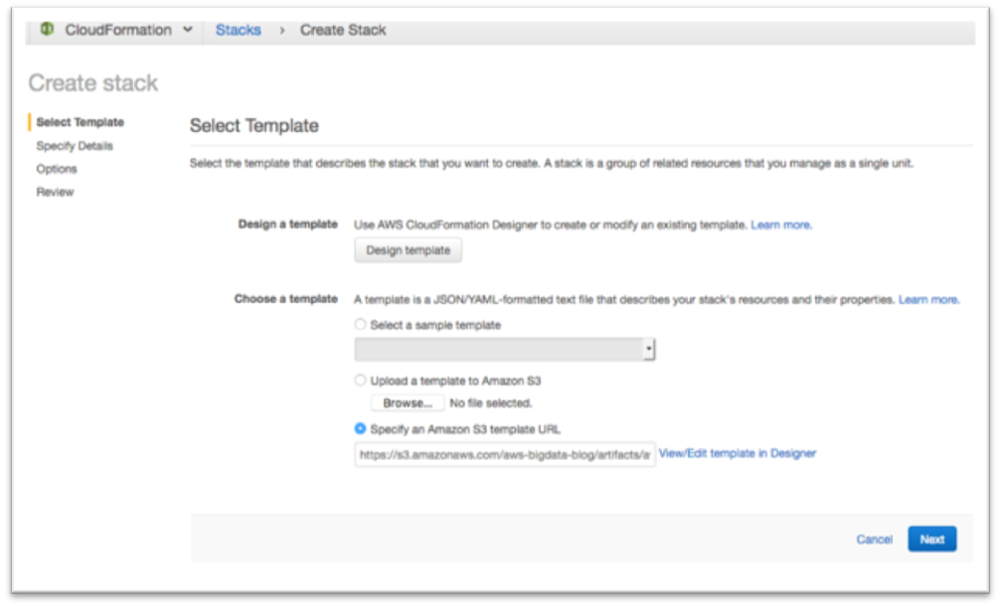

#	Bring Lex Bot to Web

##	Bring Lex Bot to Web

In this lab, you will create a web interface that can be integrated with your Lex bot. This interface allows you to interact with a Lex bot directly from a browser using text or voice. You will be using AWS CloudFormation to create this web interface. **Please use us-east-1** as the cloudformation is in us-east-1.

1.	Go to https://github.com/awslabs/aws-lex-web-ui 
2.	Go to Getting Started section, find Launch Stack. Click on it. 

 
3.	You will be brought to CloudFormation service page. If you are asked to login to AWS console, do so.

4.	Click on Next.
5.	Scroll down. You need to change a few parameters here.
*	a.	Enter “PersonalBanker” into the BotName. **This must be the exact name of your bot**. 
*	b.	Delete the text in WebAppConfBotInitialText field, and enter “You can ask me for your account info. Just type "What is my checking account balance" or click on the mic and say it.”
*	c.	Delete the text in WebAppConfBotInitialSpeech field, and enter “Say "What is my checking account balance" to get started.”
*	d.	Delete the text in WebAppConfToolbarTitle field, and enter “Personal Banker”.

6.	Click on Next.
7.	Click on Next again.
8.	Tick “I acknowledge that AWS CloudFormation might create IAM resources with custom names.” and "I acknowledge that AWS CloudFormation might require the following capability." And click on Create.

9.	It may take a few minutes. Click on the refresh button on the top right corner to see the progress. 

10.	Once the stacks are created. The status column will show green text. 
11.	Click on lex-web-ui, go to the Output section. You need to expand this section if needed.

12.	Click on WebAppUrl.
13.	Adjust your browser to an appropriate size and start chatting with your bot or speak to it.