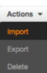

# Use Lex Import Function to Create a Lex Bot without Manually 

You don't need to do this section if you have already finished 
[Step 1.Create the Lex Bot Manually](create-lex-bot-manually.md).
The only difference is manually or automatically.

1. Go to [AWS Lex Console](https://console.aws.amazon.com/lex)

1. Click **Action**
     

1. Click **Import** 
     

1. Choose the zip file. You need to download the 
file [lex-import-personal-banker.json.zip](../workshop/lex-import-personal-banker.json.zip) 

1. Click **Import** 

1. Click **Overwrite and Continue** if you are not using these slot type.
     

1. Click on the bot you just build

1. Click **Build**

1. The build process takes approximately a minute. Once complete, 
you can ask your bot a question as a way to test it. For example, you could 
type “what is my checking balance?” in the chat window. At this stage since we 
have not added in the backend Lambda function, the response will be that the bot 
is ready for fulfillment.

Next, [Create a Lambda function](create-lex-lambda-function.md).
