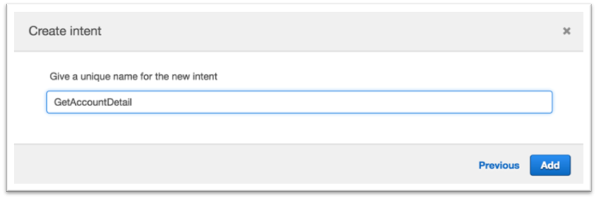
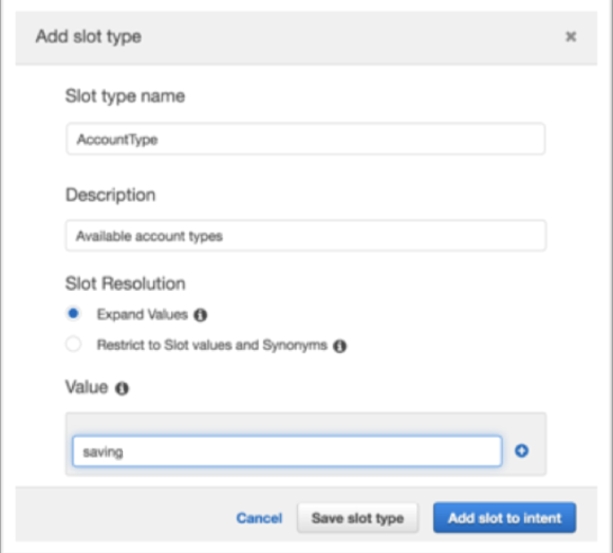
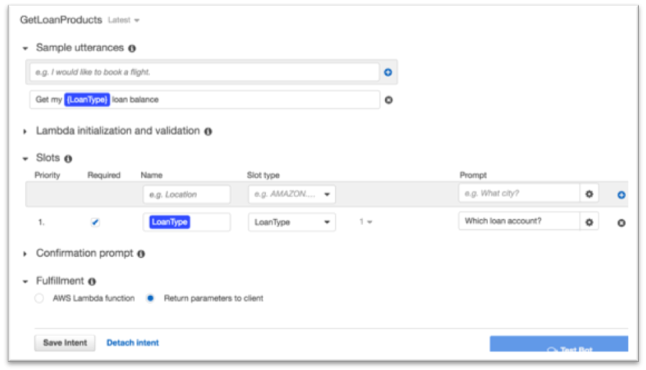

#	Create the Lex Bot Manually

##	Create the Lex Bot Manually

**This section is optional**. You can either choose to create Lex bot manually in this section, or go to [Step 2.Use Lex Import Function to Create a Lex Bot without Manually Creating Intents](create-intent-using-lex-import.md) directly. 

1.	Log in to AWS Lex Console https://console.aws.amazon.com/lex 
2.	If you have never created a bot, click “Get Started”
3.	Choose ‘Custom bot’
4.	Our bot name will be “PersonalBanker”
5.	Choose your preferred output voice
6.	Session timeout should be 5 minute 
7.	Choose “No” to the Children’s Online Privacy Protection Act (COPPA) question

8.	Click Create

9.	We will start by creating an intent, which represents an action that the user wants to perform. For example, we’re going to create three intents in this lab for different actions a user can perform: Get Account Details; Get Loan Details; Get Loan Products. **Click the “Create Intent” button**.

10.	In the window that pops-up click the “Create new intent” link.

11.	Our first intent enables the user to get account details, so name this intent “GetAccountDetail” then click “Add”.

12.	We now want to provide samples of what our user would type or say to perform this action (i.e. to activate this intent). Under “Sample utterances”, **type the below phrases and hit [enter] or click the blue “+” sign after each phrase**. Make sure you do not add a question mark at the end of the phrase as this will cause build issues later on.

*	What is my {AccountType} balance   
*	{AccountType} account balance

NOTE: {AccountType} represents a ‘slot’ which is information that we need to process the users request. Type it exactly as shown above with the braces, and in the next step we will define the ‘AccountType’ slot and list the acceptable values (checking, savings). Once the lab is complete, the user will interact with our bot by saying something like “What is my checking balance”.

13.	Next we define a slot which is information we need to process the users request. This information can be included in the utterance (query) that the user types or says, and if not included, Lex will prompt the user for the information. While Lex includes many built-in slot types (such as number, color, city, food, etc), in this case we want to define a custom slot to get the account type that the user is referring to. 
**Click on the blue “+” sign next to “Slot types” on the left hand side of the screen**

14.	For ‘Slot type name’ enter “AccountType” and optionally enter a description (although description is not required)
15.	For Value, we want to allow the user to make queries against either their “checking” or “saving” account so enter those as values, clicking the blue “+” sign after each word.

16.	Click “Add slot to intent”
17.	Change the ‘Name’ to “AccountType” so that it matches the slot name that we specified when we created the sample utterences.
18.	Specify “What type of account?” for the ‘Prompt’. This prompt will be used by our bot if the user does not specify an account type when asking a question.

19.	Scroll down and click “Save Intent”

If at any point you made a mistake in the steps above, selecting the “Latest” version of the intent at the top, next to the intent name, will allow you to edit your choices.

20.	Let’s build this simple Bot: Hit the grey Build button at the top right corner. You will be asked for confirmation to build. **Click “Build”**.  The build process takes approximately a minute. Once complete, you can ask your bot a question as a way to test it. For example, you could type “what is my checking balance?” in the chat window. At this stage since we have not added in the backend Lambda function, the response will be that the bot is ready for fulfillment.    
Let’s add 2 more intents and one more slot type. 
21.	Click the blue “+” sign next to “Intents” on the left hand side of the page, then **click “Create new intent”**. 
22.	This intent will allow users to get information on their outstanding home or car loan balance, so set the name to “GetLoanDetail” then click ‘Add’
23.	For sample utterences (the things we expect out users to type/say to our bot to trigger a specific intent/action), add the following phrase then click the blue “+” at the end of the sample utterance box.
*	“Get my {LoanType} loan balance”
24.	Now we’ll create a new slot type which we’ll use to store a response from the user as to whether they are wanting the intent to access their car loan balance or their home loan balance. **Click the blue “+” sign next to ‘Slot types’ on the left hand side of the screen**
*	For ‘Slot type name’ enter “LoanType” and optionally provide a description
*	Enter the following two options as values:
	*	car
	*	home
25.	Click ‘Add slot to intent’
26.	Change the name of the slot from “slotOne” to “LoanType” 
27.	Provide a prompt (such as “Which loan account?”)
28.	Make sure that the “Required” column is selected

29.	**Click ‘Save Intent’**。 Now we’ll add a final intent to allow users to get more information on the loan products that we have. 
30.	Click the blue “+” sign next to “Intents” on the left hand side of the page, then click “Create new intent”. 
31.	Set the name of the intent to “GetLoanProducts” then click ‘Add’
32.	For sample utterences (the things we expect our users to type/say to our bot to trigger a specific intent/action), add the following two phrases. Make sure not to include punctuation (such as comma’s or question marks).
*	“What is the rate on the {LoanType} loan”
*	“More loan info”
The “More loan info” utterance will be used as a follow-up after a user has asked for information on their outstanding loan balance.
33.	**Add a slot** (this allows us to get the loan type that the user wants to query) with the following values
*	Name: LoanType
*	Slot Type: LoanType (select from the drop-down list)
*	Prompt: Which loan type?
34.	Click the blue “+” button to the right of the Slots information to add this slot to the intent
35.	Click ‘Save Intent’
36.	Click Build, and click Build again when prompted for confirmation. 

Our bot is almost ready … all it needs now is a smart backend.