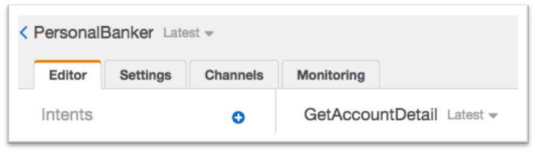

#	Link Lex bot with the Lex Lambda function

##	Link Lex bot with the Lex Lambda function
In this step we will link the three intents we created to the Lambda function. We do this by providing the Lambda function as the method that contains the business logic used to ‘fulfill’ the users requests. Once this is done (and the bot rebuilt), when a user specifies an intent (such as ‘what is my checking account balance’), Lex will call our Lambda function and pass it the intent name (‘GetAccountDetail’) and the slot value (‘checking’). 
To do this, we go back to the Lex Console https://console.aws.amazon.com/lex  

1.	Click on Personal Banker
2.	Enure the ‘GetAccountDetail’ intent is selected
3.	Make sure that the ‘Latest’ version is selected

 

4.	Scroll down to ‘Fulfillment’, select “AWS Lambda function”, choose “bot-personal-assistant” and click “OK” in the popup warning window which opens. It indicates you are giving Lex the permission to run this Lambda function.

5.	Click Save intent.
6.	Repeat the above steps 4, 5 and 6 for intents GetLoanDetail and GetLoanProducts
7.	Click “Build” and then click “Build” again on the confirmation screen.