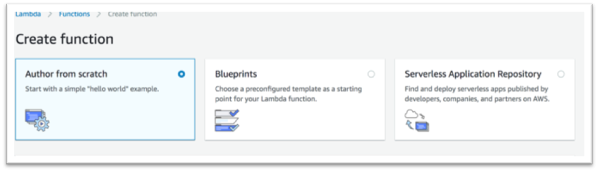
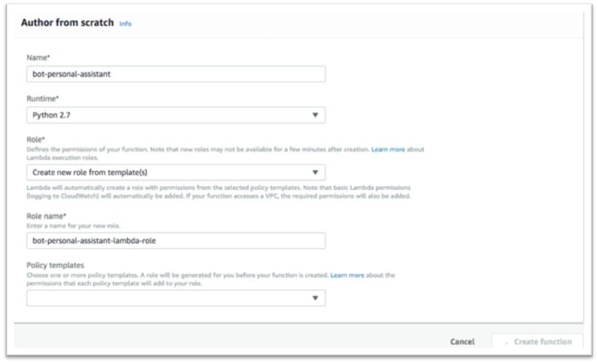
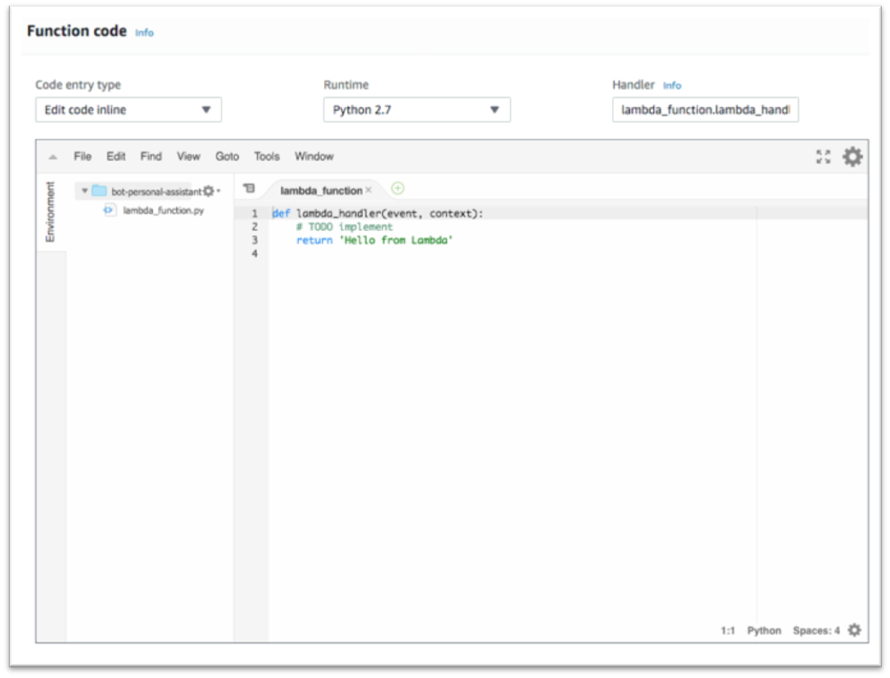

#	Create Lex Lambda Function

##	Create Lex Lambda Function

Here we will create a Lambda function that has some Python code to detect the intent name (‘GetAccountDetail’, ‘GetLoanDetail’ or ‘GetLoanProducts’) and to return static values based on the AccountType (checking, saving) or LoanType (car, home) included in the intent. In a real world example we would have already authenticated the user using account linking and would write Python code to do a database lookup for the account balances.  To get a whole picture better, let’s build the function with hard code account balances first and leave authorization to the final step. 

1.	Use the AWS Console to navigate to Lambda.
2.	Click on the orange ‘Create a function’ link under the ‘Getting Started’ section
3.	Select ‘Author from scratch’ option

4.	Let’s give our function the name of “bot-personal-assistant” and optionally provide a description. Feel free to choose a different name.
5.	Choose Python 2.7 as the Runtime
6.	We will ‘Create new role from template’. You can give it a “bot-personal-assistant-lambda-role” role name and leave the policy template empty.

7.	Click create function.
8.	Scroll down to the integrated Coud9 editor on the Lambda console.

9.	Download the lambda function code [lex-lambda-personal-banker.py](../workshop/lex-lambda-personal-banker.py). Copy and paste the code into the inline editor (while making sure to overwrite/delete any template code that is already in the code box). Take a few minutes to review the code. Please note if you named your intents differently, you will have to update the dispatch method accordingly.

10.	We are not going to configure any trigger now, so click ‘Save’ on the top right hand corner of the page. You should see a message like this.
 
 