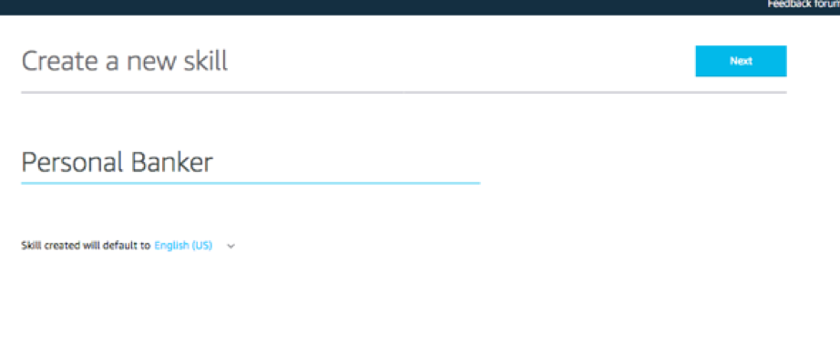
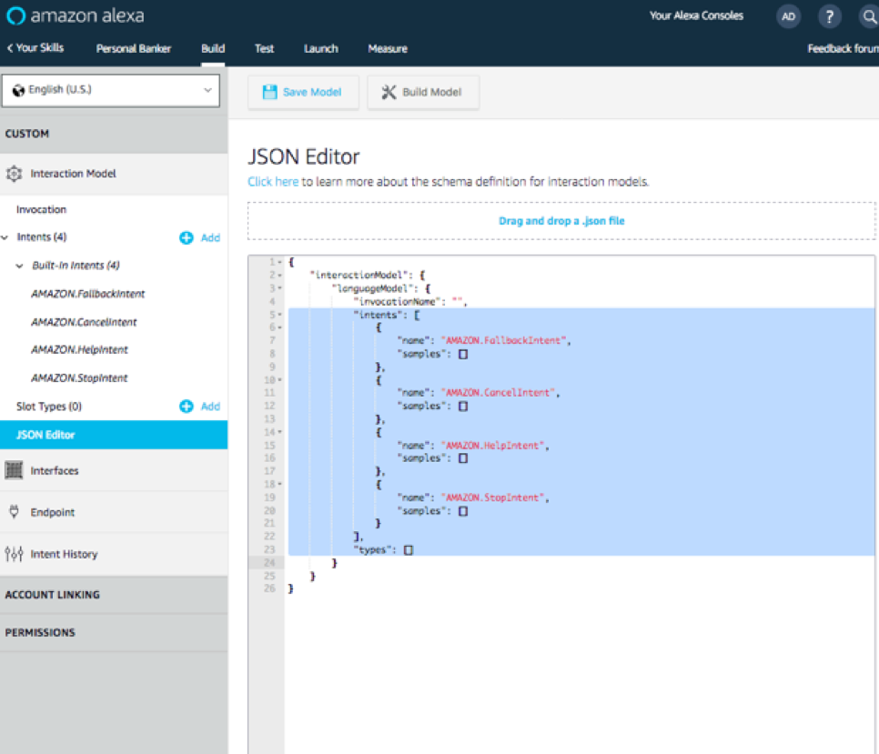

#	Export the Bot to Alexa Skills Kit

##	1. Export the Bot to Alexa Skills Kit / Lex Format
1.	Close the pop up window. Click on the Left Arrow on the top left corner.

2.	Select your bot and click on Action.

3.	Click on Export.
4.	Choose the bot version and platform as ASK. Click on Export. Save the file.

5.	Unzip the downloaded file and you will get the .json file. This will be used for Alexa Skill later. You can also export it as Lex format. The exported file can be used to replicate the same bot in another account.

>Note: You could use https://jsonformatter.curiousconcept.com/ to convert the file to standard indented json 
>if the file's original indents is not perfect

##	2. Import Lex Intents to Alexa Voice Interface 

1.	Go to the Amazon Developer Portal https://developer.amazon.com . In the top-right corner of the screen, click the "Sign In" button. (If you don't already have an account, you will be able to create a new one for free. Note it's not the same account for amazon.com) 

2.	Once you have signed in, move your mouse over the Developer Console text at the top of the screen and Select the Skills Link. 

3.	From the Alexa Skills Console select the Create Skill button near the top-right of the list of your Alexa Skills.  

4.	Give your new skill a Name. This is the name that will be shown in the Alexa Skills Store, and the name your users will refer to. Also change the locale if so desired. Push Next.  

5.	Select the Custom model button to add it to your skill, and select the Create Skill button at the top right.
 

6.	You can choose to build the Interaction Model for your skill by adding intents, slots, etc, manully, which we have already done in Lex. So we are going to re-use our Lex intents, slots. **Choose 'Start from scratch'**

7.	On the left hand navigation panel, select the JSON Editor tab under Interaction Model. In the textfield provided, replace code line 5 to 23 with the code in the zip file exported from Lex. Follow the instruction below.
*	a.	Select code line 5 to 23, delete it.

*	b.	Open the .zip file you export from Lex in Visual Studio or any other text edit file. (If you find it is hard to follow, replace the entire code in the textfield provided with alexa-developer-console-personal-banker.json. Then you can skip step c, d, e, and jump to step 8.)

*	c.	Select the highlighted part below. Copy it. 
 

*	d.	Paste it back to the Alexa console after line 4.
*	e.	Input a invocation name as shown below. 

8.	Click on Save Model and then Build Model. 
9.	Note: You should notice that Intents and Slot Types will auto populate based on the JSON Interaction Model that you have now applied to your skill. 

10.	If your interaction model builds successfully, proceed to the next step. If not, you should see an error. Try to resolve the errors. In our next step of this guide, we will be creating our Lambda function in the AWS developer console, but keep this browser tab open, because we will be returning here.